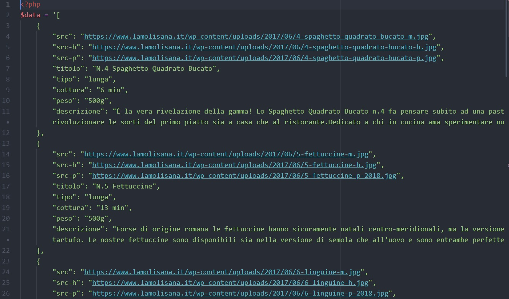
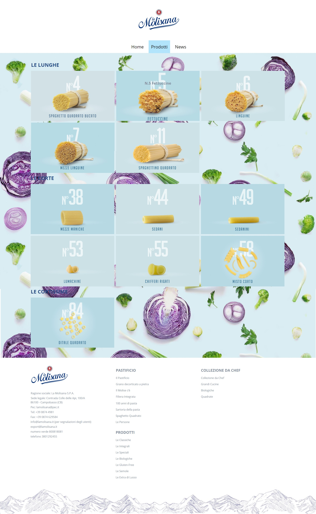
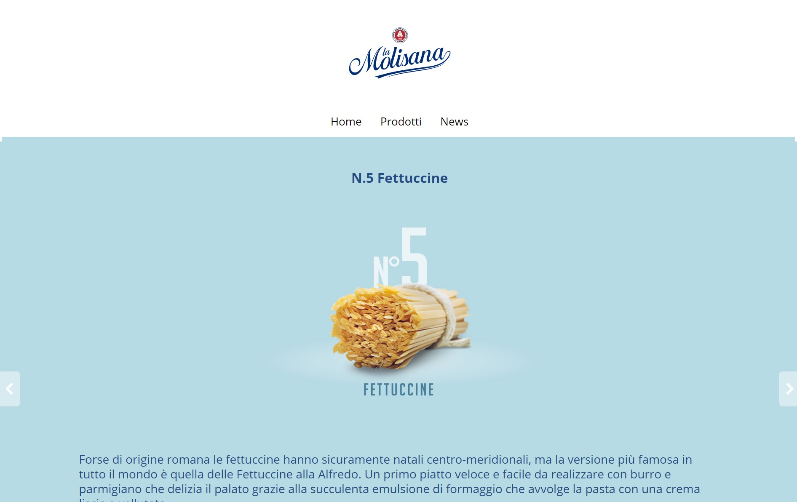
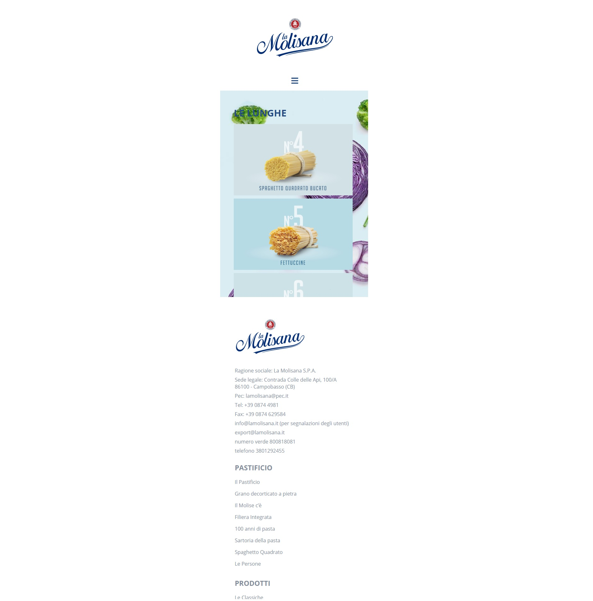
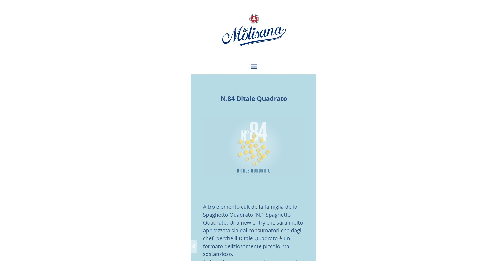

# Laravel-primi-passi
Website to show the list of products available.   
When clicking on a product it's data is passed to the layout.   
The user has the option to see the next or previous product by clicking on the corresponding arrow.

HTML, CSS, PHP, Laravel.
***
### Preview-api:

### Preview-lg:  

### Preview-lg:  

### Preview-xs:  

### Preview-xs:  

